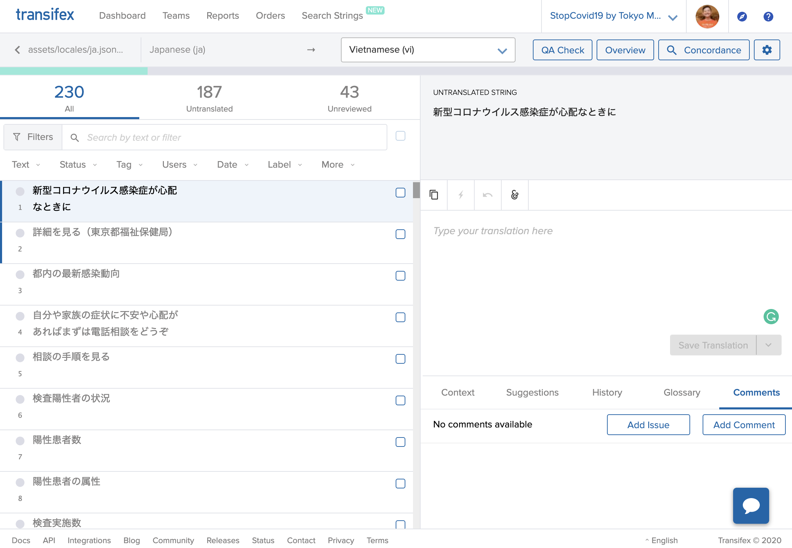

# 如何贡献翻译

我们正在使用Transifex来管理多国语言的内容。

## 给翻译的贡献者们

请到我们在Transifex的项目页面。
https://www.transifex.com/stopcovid19-tokyo/stopcovid19tokyo

请加入我们的小组，点击`协助翻译“StopCovid19Tokyo”`按钮。在加入小组之前会需要建立或是登入帐号。

加入后，前往dashboard页面。

https://www.transifex.com/stopcovid19-tokyo/stopcovid19tokyo/dashboard/

在想要帮忙翻译的语言上面按下`翻译`按钮。

您会看到翻译编辑器。在左边的内存块搜寻想要翻译的文字，然后在右边的内存块输入翻译过后的文字。

编辑过后，记得按下`储存变更`按钮。

完成翻译后，开发小组会把最新的翻译更新。

Transifex有很多有用的功能，像是字典功能，如果您觉得好用请自由使用。如果有任何其他提案也欢迎提出。

## 新增语言

如果想要新增语言。请透过Transifex系统提交申请。然而，在考察审核翻译的工作量下，我们可能不会接受。

## 给开发者

如果你有新增文字需要翻译，请把字串加到`../assets/locales/ja.json`并推送Pull Request到`development`分支。您可以用相同字串作为key和value。

我们正在使用[nuxt-i18n](https://github.com/nuxt-community/nuxt-i18n)作为翻译引擎。请参考[他们的文件](https://nuxtjs.org/examples/i18n/)来了解如何使用这个函式库（Library）。

如果你急需这个文字的翻译的话，请在Code for Japan Slack(查看[教学](https://github.com/tokyo-metropolitan-gov/covid19/blob/development/docs/zh_TW/CONTRIBUTING.md#%E5%A6%82%E4%BD%95%E5%8F%83%E8%88%87%E4%BA%A4%E6%B5%81))的# covid19频道中，要求从Transifex推送最新的更新。

文字翻译过后，组织者会把新的资源档套用到`development`分支上。
